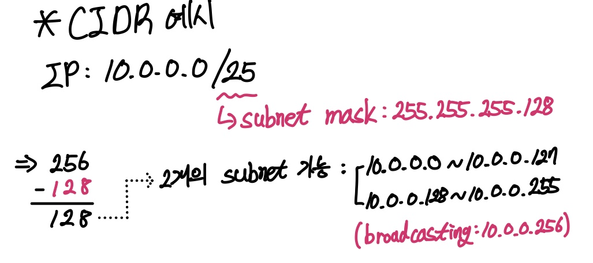

# Ch04. 독립적인 나만의 가상 네트워크 공간 만들기

## 1. Network
: 컴퓨터들이 통신 기술을 이용하여 그물망처럼 연결된 통신 이용 형태  
#### 프로토콜: 통신을 위해 지켜야 하는 규약

## 2. VPN(; Virtual Private Network)
: 큰 규모의 조직이 여러 곳에 분산돼 있는 컴퓨터들을 연결하는 **보안성이 높은 사설 네트워크를 만들거나**, 인터넷을 활용하여 **원격지 간에 네트워크를 서로 연결하고 암호화 기술을 적용**하여 보다 안정적이고 보안성이 높은 통신 서비스를 제공하는 서비스  

**⭐️ AWS는 VPC와 VPC Gateway를 통해 On-Premise의 VPN 장비와 AWS 간의 VPN을 연결**
- 보안성 높은 Hybrid Cloud 환경 구현
- 원활한 클라우드 컴퓨팅 지원

## 3. VPC(; Virtual Private Cloud)
: AWS Cloud에서 논리적으로 격리된 네트워크 공간을 할당하여 가상 네트워크에서 AWS 리소스를 이용할 수 있는 서비스 제공  

- 가상 네트워크 환경을 완벽히 제어
    - VPC 자제 IP 주소 범위, 서브넷 생성, 라우팅 테이블 및 네트워크 게이트웨이 구성 선택 등
- IPv4와 IPv6를 모두 사용하여 resource와 application에 안전하고 쉽게 액세스
- 보안 그룹 및 네트워크 제어 목록을 포함한 다중 보안 계층 활용
    - → 각 서브넷에서 EC2 인스턴스에 대한 액세스 제어 가능

## 4. VPU의 구성 요소
### **i) IP**
**프라이빗 IP 주소(Private IP Address)**  
- : VPC 내부에서만 사용할 수 있는 IP Address
- VPC에서 시작된 인스턴스 서브넷 범위에서 자동 할당
- 추가 프라이빗 주소 할당 가능  

**퍼블릭 IP 주소(Public IP Address)**
- : 인터넷을 통해 연결할 수 있는 IP 주소
- 인스턴스와 인터넷 간 통신을 위해 사용
- EC2 생성 시 사용 여부 선택 가능
- 수동으로 연결 및 해제 불가능
- 인스턴스 재부팅 시 새로 할당

**탄성 IP 주소(Elastic IP Address)**
- : 동적 컴퓨팅을 위해 고안된 고정 Public IP Address
- 사용 가능한 탄력적 IP 주소는 5개로 제한  

```text
💰 탄력적 IP 주소 요금에 대한 이해
: 다음 모든 조건에 해당하는 경우에는 탄력적 IP 주소에 대한 비용이 발생하지 않습니다.

☛ 탄력적 IP 주소가 EC2 인스턴스에 연결되어 있습니다.
☛ 탄력적 IP 주소와 연결된 인스턴스가 실행 중입니다.
☛ 인스턴스에 연결된 탄력적 IP 주소가 하나만 있습니다.
☛ 탄력적 IP 주소가 첨부된 네트워크 인터페이스에 연결되어 있습니다.
```

### **ii) VPC와 서브넷**
: 사용자의 AWS 계정을 위한 전용 가상 네트워크  
- AWS 클라우드에서 다른 가상 네트워크와 논리적으로 분리돼 있음
- 서비스 목적에 따라 IP Block으로 나누어 구분
- 분리된 IP Block의 모음 → 서브넷
- VPC는 리전의 모든 AZ에 적용, 각 AZ에 하나 이상의 서브넷 추가 가능
- 서브넷은 단일 AZ에서만 생성 가능

### **iii) VPC와 서브넷 사이즈**
→ VPC를 생성할 때 VPC에서 사용하기 될 IP 주소의 범위를 지정하게 되는데, 범위를 **CIDR(; Classless Inter-Domain Routing)** 블록 형태로 지정해야 함  
<p align='center'>  </p>

### **iv) 퍼블릭 서브넷과 프라이빗 서브넷**
**Public Subnet**: 서브넷 네트워크 트래픽이 인터넷 게이트웨이로 라우팅이 되는 서브넷  
**Private Subnet**: 인터넷 게이트웨이로 라우팅 되지 않는 서브넷  

> 일반적으로 인터넷 망을 통해 서비스를 수행하는 **Web Server는 Public Subnet에 생성**  
> 인터넷과 직접적으로 연결할 필요 없고, 보다 높은 보안성이 필요한 **DB Server는 Private Subnet에 생성**

### **v) 라우팅 테이블**
→ 각 서브넷은 서브넷 외부로 나가는 아웃바운드 트래픽에 대해 허용된 경로를 지정하는 라우팅 테이블이 연결돼 있어야 함

## 5. VPU의 주요 서비스
### **i) 보안 그룹(Security Group)과 네트워크 액세스 제어 목록(Network ACL)**
→ 네트워크 통신과 트래픽에 대해 IP와 Port를 기준으로 통신을 허용하거나 차단하기 위한 기능  

|**구분**         |**보안그룹**              |**네트워크 ACL**                |
|----------------|------------------------|-----------------------------|
|**서비스 범위**    |인스턴스 레벨에 적용         |서브넷 레벨에 적용                |
|**적용 정책**     |Allow 규칙만 적용          |Allow 및 Deny 규칙 적용         |
|**구동 방식**     |규칙에 상관없이 반환 트래픽 허용|반환트래픽이 별도로 적용되어야 함     |
|**Rule 검토/적용**|해당 객체 내 모든 Rule 검토  |해당 객체 내 Rule을 번호 순으로 처리 |
|**적용 방법**     |인스턴스에 보안 그룹 추가     |연결된 서브넷에 모든 인스턴스 자동 적용|

### **ii) VPC 피어링 연결(VPC Peering Connection)**
→ 비공개적으로 두 VPC 간 트래픽을 라우팅할 수 있게 하기 위한 서로 다른 VPC 간의 네트워크 연결 제공 (서로 다른 VPC의 인스턴스 간 Ping&Pong 가능)  

**⭐️ AWS는 대부분의 리전에서 리전 간 VPC Peering 제공**

### **iii) NAT(Network Address Translation) 게이트웨이**
: 외부 네트워크에 알려진 것과 다른 IP 주소를 사용하는 내부 네트워크에서, 내부 IP 주소를 외부 IP 주소로 변환하는 작업을 수행하는 서비스   

- Private Subnet 내에 있는 인스턴스를 인터넷 또는 다른 AWS 서비스에 연결하는 데 사용
- 윈도우 패치나 보안 업데이트, SW 업데이트를 인터넷을 통해 받아야 하는 경우 사용
- NAT 게이트웨이 구성을 위한 세 가지 조건
    - Public Subnet 지정
    - NAT 게이트웨이와 연결할 Elastic IP 주소 필요
    - Private Subnet과 연결된 라우팅 테이블 업데이트

### **iv) VPC Endpoint**
- S3와 같은 공용 리소스에 대해 Public Subnet에 위치한 인스턴스는 인터넷으로 연결 가능
- Private Subnet에 위치한 인스턴스는 불가능
    - NAT 게이트웨이나 NAT 인스턴스 필요
    - But. VPC EndPoint를 이용하면 빠르고 손쉽게 S3나 DynamoDB 연결 가능

### **v) VPN(Virtual Private Network) 연결**
**AWS VPC 내 인스턴스와 IDC 내 시스템 간의 데이터 통신을 위해 아래 작업을 통해 Hybrid Cloud 환경 구축**
- VPC에 가상의 Private Gateway 연결
- 사용자 지정 라우팅 테이블 생성
- 보안 그룹의 규칙 업데이트
- AWS 관리형 VPN 연결을 생성
