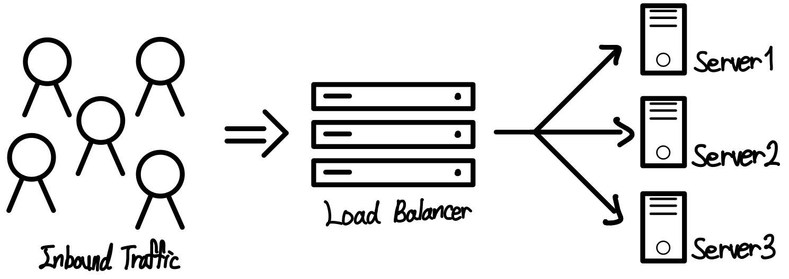
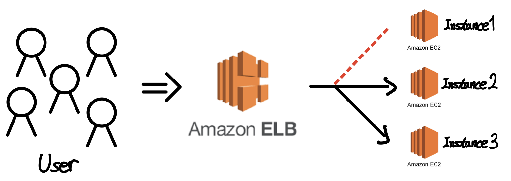
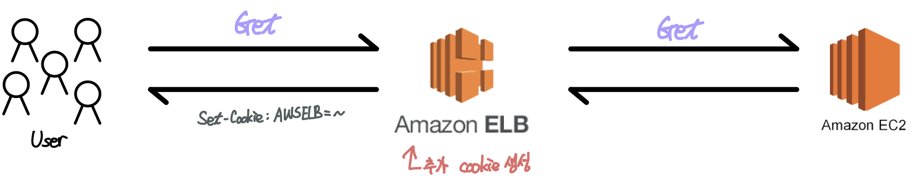

# Ch07. 네트워크 트래픽을 분산시켜 주는 로드 밸런싱

## 1. 로드 밸런싱
def) 네트워크 트래픽을 하나 이상의 서버나 장비로 분산하기 위해 사용되는 기술  

### **✓ 트래픽 증가에 대한 처리 방식**
- **Scale-Up** : CPU, 메모리, 디스크 등의 기능 업그레이드
    - 비용이 기하급수적으로 증가
    - 하나의 서버에서 웹 서비스 제공 → 서버 중지 및 장애 발생 시 가용성에 문제 발생
- **Scale-Out** : 저렴한 노드 여러 개를 하나의 Cluster로 구성하는 방식
    - 하나의 노드에 문제가 발생해도 웹 서비스 중단 X
    - Scale-Out 방식의 웹 서비스 구성에 로드 밸런싱을 주로 사용

## 2. 로드 밸런싱의 방식
### ✓ Round Robin
- Real 서버로의 Session 연결을 순차적으로 맺어주는 방식
- 각 서버가 동일한 스펙을 가지고 있고, Session이 오래 지속되지 않는 경우 적합
- Session에 대해 보장을 제공하지 않음

### ✓ Weighted Round Robin
- 각 서버마다 가중치를 매기고 가중치가 높은 서버에 우선적으로 배정하는 방식
- 각 서버의 트래픽 처리 속도가 상이한 경우에 적합

### ✓ Hash
- Hash 알고리즘을 이용한 로드 밸런싱 방식
- Client가 해시함수를 통해 특정 Server로 연결된 이후 동일 서버로만 연결되는 구조
- Session에 대한 보장 제공

### ✓ Least Connection
- Session 수를 고려하여 가장 작은 Session을 보유한 서버로 Session을 맺어주는 연결 방식
- 서버에 분배된 트래픽이 일정하지 않은 경우 적합
- Session에 대한 보장을 제공하지 않음

### ✓ Response Time
- 응답시간을 고려하여 빠른 응답시간을 제공하는 서버로 Session을 맺어주는 방식
- Session에 대한 보장을 제공하지 않음

## 3. Amazon Elastic Load Balancing
- 단일 AZ 또는 여러 AZ에서 **동일한 서비스**를 제공하기 위해 준비된 여러 대상으로 애플리케이션 및 네트워크 트래픽 자동으로 분산
    - ex) EC2 인스턴스 및 컨테이너, IP addr
- 서비스 목적에 따라 세 가지의 로드 밸런서 중 택 1
    - 고가용성, 부하분산, 자동 확대/축소, 보안 기능 제공

## 4. ELB의 종류 및 유형
### **✓ Application Load Balancer**
- Application 계층에서 작동
- HTTP, HTTPS와 같은 고급 로드 밸런싱 서비스에 적합
- 마이크로 서비스 및 컨테이너 기반 애플리케이션, 최신 애플리케이션 서비스에 최적화된 로드 밸런싱 제공
- SSL/TLS 암호화 및 프로토콜 사용하여 보안성 보장

### **✓ Network Load Balancer**
- Transport 계층에서 작동
- TCP 트래픽의 로드 밸런싱 서비스에 적합
- 적합 서비스 특징:
    - 짧은 지연시간
    - 초당 수백만 개의 요청 처리 가능
    - AZ당 1개의 정적 주소 사용
    - 트래픽 변동이 심함

### **✓ Classic Load Balancer**
- Transport 계층, Network 계층에서 작동
- EC2-Classic 네트워크 내에 구축된 애플리케이션을 대상으로 제공

**⭐️ Classic Load Balancer에서는 로드 밸런서에 인스턴스 등록**  
**⭐️ 나머지는 대상을 대상 그룹에 등록하고 트래픽을 대상 그룹에 라우팅**

## 5. ELB의 주요 특징
### **1️⃣ 상태 확인 서비스 (Health Check)**
- 연결된 인스턴스의 연결 상태를 수시로 체크
- 연결 장애나 서비스 가능 여부에 대한 Health Check를 지속적 수행
- Health Check 실패 → 해당 인스턴스로 트래픽 전달 X

### **2️⃣ Sticky Session**
- Sticky Session을 사용하여 처음 연결된 Client에 별도의 HTTP 기반의 쿠키 값을 생성하여 다음 번 연결 요청에 대해 처음 접속했던 서버로 계속 연결하도록 트래픽 처리

### **3️⃣ 고가용성 구성**
- 단일 AZ 또는 여러 AZ에 있는 여러 대상에 걸쳐 트래픽 자동 분산
- AWS 다른 서비스(ex. Route 5S)와의 연계를 통해 가용성 서비스 제공

### **4️⃣ SSL Termination 및 보안 기능**
- ELB에 공인인증서 또는 ACM에서 무료로 발급받을 수 있는 사설 인증서 등록
    - SSL 인증서를 이용한 HTTPS 활용 트래픽 암호화 및 복호화 서비스 제공 가능
    - 개별 인스턴스에 SSL 인증서를 직접 설치할 필요 없음
