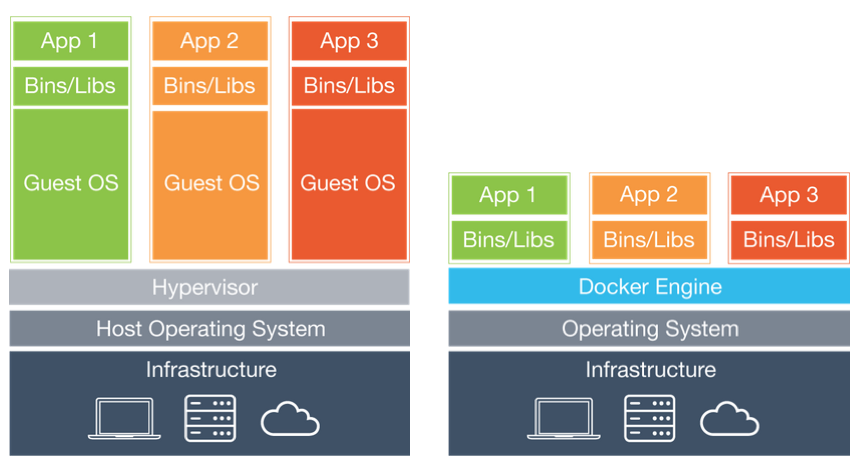

# Docker 간단 정리

## 1. 기본 개념
### 🐳 도커란?
: application을 패키징할 수 있는 툴  
→ 컨테이너 안에 application과 현경설정, dependencies를 묶어서 어떤 상황, 어떤 환경에도 쉽게, 안정적으로 구동할 수 있게 해줌  

### ❗️ VM과 도커의 차이
  

- **VM**
    - Infrastructure(HW) 위에 Hypervisor SW를 이용해 각각의 가상머신을 만들 수 있음
    - 한 OS 위에서 동일한 application을 각각의 고립된 환경에서 구동하기 위해 사용
    - OS를 포함하기 때문에 굉장히 무거움
    - 구동 시간이 오래 걸림
    - 하드웨어의 resource를 많이 잡아먹음
    - ex) **vmware**, **VirtualBox**
- **Container**
    - HW에 설치된 Host OS에서 컨테이너 엔진이라는 SW만 설치하면 개별적인 컨테이너를 만들어 각각의 application을 고립된 환경에서 구동해줌
    - OS를 포함하지 않음  
    - ex) **Docker**  

### 🐳 도커의 3대 구성요소
→ 컨테이너를 만들고 구동한다.  
- **Dockerfile** : 컨테이너를 어떻게 만들어야 하는지에 대한 설명서
    - Copy files
    - Install dependencies
    - Set environment variables
    - Run setup scripts
- **Image** : 실행되고 있는 application의 스냅샷 (불변의 상태)
- **Container** : 이미지를 고립된 환경에서 실행  

### 📮 도커 이미지 배포
- Local Machine에서 image를 만들어 Container Registry에 PUSH
- 필요한 Server나 다른 개발자 PC에서 PULL
- 실행  

- Public Service
    - docker hub
    - RED HAT
    - GitHub Packages
- Private Service
    - AWS
    - GCP
    - Microsoft Azure   

* * *

### 📚 참고 영상
🛑 YouTube: [드림코딩](https://youtu.be/LXJhA3VWXFA)

