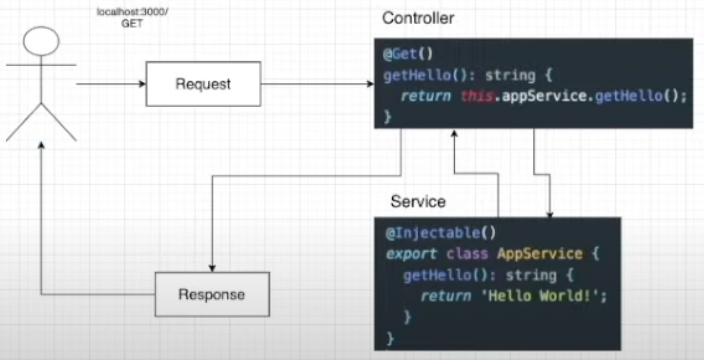
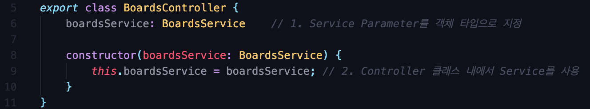

# about "Nest js Framework"

## 1. NestJS란?
def) 효율적이고 확장 가능한 Node js 서버 측 애플리케이션을 구축하기 위한 framework  
- progressive한 JavaScript를 사용하고, TypeScript로 빌드 
- OOP, FP, FRP 요소를 사용할 수 있게 해줌

### ❖ 내부 구성
- Express(기본값)와 같은 강력한 HTTP 서버 프레임 워크를 사용하며 선택적으로 Fastify를 사용하도록 구성 가능  
    - (📝 Fastify: Node js를 위한 빠르면서도 오버헤드가 적은 Web Framework)  
- Node js Framework(Express or Fastify) 위에 추상화 수준을 제공하지만, API를 개발자에게 직접 노출하고, 이를 통해 개발자는 기본 플랫폼에서 사용할 수 잇는 수많은 타사 모듈을 자유롭게 사용할 수 있음

### ❖ 철학
: 개발자와 팀이 고도로 테스트 가능하고, 확장 가능하며, 느슨하게 결합되고 유지 관리가 쉬운 애플리케이션을 만들 수 있는 즉시 사용 가능한 애플리케이션 아키텍처를 제공함

### ❖ 공식문서: [Nest JS 공식문서](https://docs.nestjs.com/)

## 2. NestJS 시작하기
- Nest CLI를 이용하여 프로젝트 시작
```shell
$ npm i -g @nestjs/cli
$ nest new project-name
```  

- **.eslintrc.js**
    - 개발자들이 특정한 규칙을 가지고 코드를 깔끔하게 짤 수 있게 도와주는 라이브러리
    - ts를 쓰는 가이드 라인 제시
    - 문법에 오류가 나면 알려주는 역할, etc
- **.prettierrc**
    - 코드의 형식을 맞춰줌
    - 작은 따옴표를 사용할지, 큰 따옴표를 사용할지
    - Indent 값을 2로 줄지, 4로 줄지 등
    - 코드 포맷터 역할
- **nest-cli.json**
    - nest js 프로젝트 자체에 필요한 설정
- src/**main.js**
    - application 생성
    - 프로젝트 실행 시작점  

**☛ 프로젝트를 시작할 때는 " $ npm run start:dev " → (package.json 참고)**  

## 3. Nest 로직 흐름

```typescript
// main.ts
import { NestFactory } from '@nestjs/core';
import { AppModule } from './app.module';

async function bootstrap() {
  const app = await NestFactory.create(AppModule);
  await app.listen(3000); // 포트 설정
}
bootstrap();
```
- app.module.ts에 등록돼 있는 모듈을 main.ts에서 create해줌
- 포트 설정 후 실행
- app.controller.ts에서 모듈 실행  

  

## 4. NestJS 모듈
: 게시판 Application을 만든다면 Root 모듈 안에 Board 모듈, Auth 모듈이 포함돼 있고, 각 모듈 안에는 controller, service, repository, entity 등이 있다.  

- **Nest JS 모듈**: @Module () 데코레이터로 주석이 달린 클래스
- **@Module () 데코레이터**: Nest가 application 구조를 구성하는 데 사용하는 메타 데이터를 제공
- 각 응용 프로그램에는 하나 이상의 모듈(root module)이 있음
- root module: Nest가 사용하는 시작점
- 같은 기능에 해당하는 것들은 하나의 모듈 폴더 안에 넣어서 사용
- 모듈은 기본적으로 Single-tone → 여러 모듈 간 쉽게 공급자의 동일한 인스턴스 공유 가능  

### ❖ Module 생성 명령어
```shell
$ nest g module 모듈이름
```  
- nest: nest-cli 사용
- g: generate  

## 5. NestJS 컨트롤러
: 들어오는 request를 처리하고 클라이언트에 response를 반환  

- **@Controller() 데코레이터**: 컨트롤러 클래스 정의  
- **Handler**: @Get, @Post, @Delete 등과 같은 데코레이터로 장신 된 컨트롤러 클래스 내의 단순한 메서드

### ❖ Controller 생성 명령어
```shell
$ nest g controller 컨트롤러이름 --no-spec
```  
- --no-spec: 테스트를 위한 소스 코드를 생성하지 않는 옵션  

## 6. NestJS 서비스
: Service 안에서 DB 관련 로직 처리  
```shell
$ nest g service 서비스이름 --no-spec
```  
- 생성된 Service에는 Injectable 데코레이터가 있음
- **Injectable** → 다른 컴포넌트에서 이 서비스를 사용할 수 있게 만듦  

### ❖ Service를 Controller에서 이용할 수 있게 해주기
: Nest JS에서 Dependency Injection은 클래스의 Constructor 안에서 이루어 짐
**☛ Dependency Injection**  

- 📝 Typescript의 도움을 받아 접근 제한자 사용 가능  

  

dd

* * *

참고 영상 및 이미지 출처: [John Ahn님 강의](https://www.youtube.com/watch?v=3JminDpCJNE)