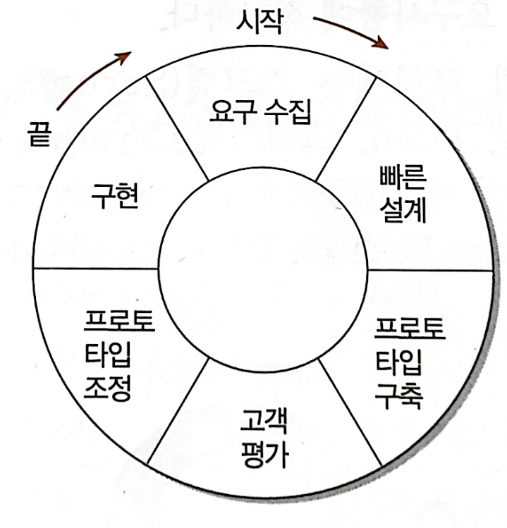
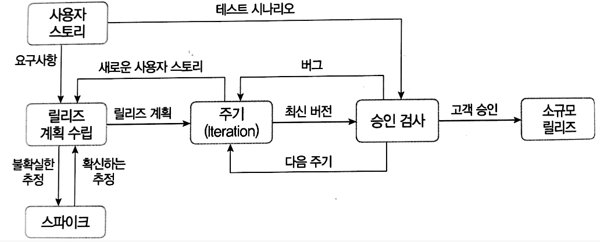
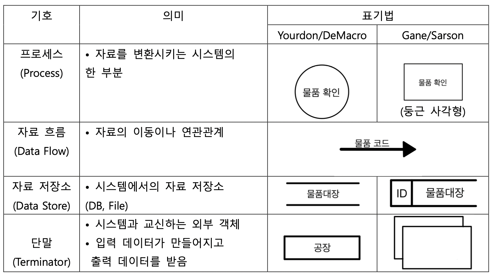

# I. 요구사항 확인

## 01. 소프트웨어 생명 주기 (A)
  
   

### ❖ 소프트웨어 생명주기 
: SW를 개발하기 위해 정의하고 운용, 유지보수 등의 과정을 각 단계별로 나눈 것  
- SW 개발 방법론의 바탕이 됨  
- SW 공학의 목적: 품질 및 생산성 향상
- SW 공학의 기본 원칙
    - 현대적인 프로그래밍 기술을 계속적으로 적용
    - 개발된 SW의 품지이 유지되도록 지속적 검증
    - SW 개발 관련 사항 및 결과에 대한 명확한 기록 유지  
  
   

### ❖ Waterfall Model
: 이전 단계로 돌아갈 수 없다는 전제하에 각 단계를 확실히 매듭짓고 그 결과를 철저하게 검토하여 승인 과정을 거친 후 다음 단계를 진행하는 개발 방법론  
- 선형 순차적 모델
- 고전적 생명 주기 모형 (가장 오래되고 폭 넓게 사용됨)
- 제품의 일부가 될 메뉴얼 작성 필요
- 각 단계가 끝난 후엔 다음 단계를 수행하기 위한 결과물 산출이 명확해야 함
- 두가지 과정 병형 X
- 타당성 검토 → 계획 → 요구 분석 → 설계 → 구현 → 테스트 → 유지보수  
  
   

### ❖ Prototype Model
: 사용자의 요구사항을 정확히 파악하기 위해 실제 개발될 SW에 대한 Prototype을 만들어 최종 결과물을 예측하는 모형  
- 사용자와 시스템 사이의 Interface에 중점을 두어 개발
- 요구된 Prototype을 구현하면 이는 추후 사용될 골격 코드가 됨
- 개발이 완료된 시점에서 오류가 발견되는 Waterfall Model의 단점을 보완  
  

### ❖ Spiral Model
: Waterfall Model과 Prototype Model의 장점에 위험 분석 기능을 추가하는 모형  
- 나선을 따라 돌듯 여러 번 SW 개발 과정을 거쳐 점진적으로 완벽한 최종 SW 개발
- 개발 과정에서 발생할 수 있는 위험 관리 및 최소화가 목적  
- 점진적으로 개발 과정이 반복되므로 요구사항 첨가 가능 && 유지보수 필요 X
- 계획 수립 → 위험 분석 → 개발 및 검증 → 고객 평가  

### ❖ Agile Model
: 고객의 요구사항 변화에 유연하게 대응할 수 있도록 일정한 주기를 반복하면서 개발과정 진행
- 고객과의 소통에 초점을 맞춤
- 스프린트 주기를 반복하며, 스프린트 주기마다 만들어지는 결과물에 대한 고객의 평가와 요구 수용
- 고객이 요구사항에 우선순위를 부여하여 개발 진행
- Scrum, XP, Kanban, Lean, Crystal, ASD, 기능 중심 개발(FDD), DSDM, DAD, etc...
- 4가지 핵심 가치
    - 개인과 상호작용
    - 실행되는 SW
    - 고객과 협업
    - 변화에 반응  

|구분|폭포구 모형|애자일|
|---|--------|----|
|새로운 요구사항 반영|어려움|지속적 반영|
|고객과의 의사소통|적음|지속적|
|테스트|마지막에 모든 테스트 진행|스프린트마다 테스트|
|개발 중심|계획, 문서|고객의 요구사항|

   

* * *

## 02. 스크럼 기법 (B)

### ❖ Scrum
: 팀이 중심이 되어 개발의 효율성을 높인다는 의미가 내포된 용어  
→ 팀원 스스로가 스크럼 팀을 구성(self-organizing)해야 하고, 개발 작업에 관한 모든 것을 스스로 해결(cross-functional) 가능해야 함  

- PO(; Product Owner)
    - 이해관계자 중 제품에 대한 이해도가 높고, 요구사항을 책임지고 의사 결정할 사람으로 선정
    - 요구사항이 담긴 Backlog를 작성하고 이에 대한 우선순위 지정
    - 팀원들은 Backlog에 Story를 추가할 수 있지만, 우선순위 지정 불가능
    - 제품에 대한 테스트를 수행하면 주기적으로 요구사항의 우선순위 갱신
- SM(; Scrum Master)
    - 팀이 Scrum을 잘 수행할 수 있도록 객관적 시각에서 조언 해주는 가이드 역할
    - 일일 스크럼 회의를 주관하여 진행 사항 점검
    - 개발 과정에서 발생된 장애 요소 공론화 및 처리
- DT(; Development Team)
    - 제품 책임자와 스크럼 마스터를 제외한 모든 팀원

### ❖ 스크럼 개발 프로세스
: Product Backlog → Sprint 계획 → Sprint 수행 및 일일 Scrum 회의 → Sprint 리뷰 및 회고  

- Product Backlog
    - 제품 개발에 필요한 모든 요구사항을 우선순위에 따라 나열한 목록
    - 개발 과정에서 새롭게 도출되는 요구사항으로 인해 지속적 업데이트
    - Product Backlog의 사용자 스토리 기반으로 릴리즈 계획 수립
- Burn-down Chart
    - 해당 스프린트에서 수행할 작업의 진행 상황을 확인할 수 있도록 시간의 경과에 따라 남은 작업 시간을 그래프로 표현한 것

  
 

* * *

## 03. XP(eXtreme Programming) 기법 (A)

### ❖ XP(eXtreme Programming)
: 수시로 발생하는 고객의 요구사항에 유연하게 대응하기 위해 고객의 참여와 개발 과정의 반복을 극대화하여 개발 생산성을 향상시키는 방법  
- 짧고 반복적인 개발 주기, 단순한 설계, 고객의 적극적인 참여를 통해 SW를 빠르게 개발하는 것이 목적
- 릴리즈의 기간을 짧게 반복하여 고객의 요구사항 반영에 대한 가시성을 높임
- 릴리즈 Test마다 고객이 직접 참여 → 요구한 기능의 작동 직접 확인
- 비교적 소규모 인원의 개발 프로젝트에 효과적
- 5가지 핵심 가치: 의사소통, 단순성, 용기, 존중, 피드백  
  
### ❖ XP 개발 프로세스
  

- Release
    - 몇 개의 스토리(요구사항)이 완료된 제품을 제공하는 것
- Spike
    - 요구사항의 신뢰성을 높이고, 기술 문제에 대한 위험을 감소시키기 위해 별도로 만드는 간단한 프로그램
- Iteration
    - 하나의 Release를 더 세분화 한 단위 (1~3주 정도의 기간으로 진행)
  
### ❖ XP의 주요 실천 방법
|실천 방법|내용|
|-------|---|
|Pair Programming|다른 사람과 함께 프로그래밍을 수행 ☛ 개발에 대한 책임을 공동으로 나눠갖는 환경 조성|
|Collective Ownership (공동 코드 소유)|개발 코드에 대한 권한과 책임을 공동으로 소유|
|Test-Driven Development (테스트 주도 개발)|• 실제 코드 작성 전 테스트 케이스 먼저 작성 • 테스트를 지속적으로 진행하기 위해 자동화된 테스팅 도구 사용|
|Whole Team (전체 팀)|개발에 참여하는 모든 구성원(고객 포함)들은 각자 자신의 역할이 있고,   역할에 대한 책임을 가져야 함|
|Continuous Integration (지속적 통합)|모듈 단위로 나눠 개발된 코드들을 하나의 작업이 마무리 될 때마다  지속적으로 통합|
|Design Inprovement(디자인 개선) Refactoring(리팩토링)|프로그램의 기능 변경 없이 단순화, 유연화 강화 등을 통해 시스템 재구성|
|Small Releases|릴리즈 기간을 짧게 반복 ☛ 고객의 요구 변화에 신속히 대응 가능|

  
 

* * *

## 04. 현행 시스템 파악 (B)

### ❖ 현행 시스템 파악 절차
|단계|설명|
|---|---|
|1단계|• 시스템 구성 파악(기간업무, 지원업무) • 시스템 기능 파악 • 시스템 인터페이스 파악(데이터 종류, 형식, 프로토콜, 주기 등)|
|2단계|• 아키텍처 구성 파악(기간 업무 수행에 어떤 기술 요소들이 사용되는지 계층별 표현) • SW 구성 파악(라이센스 적용 방식, 보유 라이센스 파악)|
|3단계|• HW 구성 파악 • Network 구성 파악(물리적인 위치 관계, 보안 취약성 분석 및 대응)|

 

* * *

## 05. 개발 기술 환경 파악 (B)

### ❖ 개발 기술 환경
: 개발하고자 하는 SW와 관련된 OS, DBMS, Middle Ware 등을 선정할 떄 고려해야 할 사항 기술
: Open Source 사용 시 주의해야 할 내용 제시  
  
### ❖ OS
: 컴퓨터 시스템의 자원들을 효율적으로 관리하며, 사용자가 컴퓨터를 편리하고 효율적으로 사용할 수 있도록 환경을 제공하는 SW  
- OS 관련 요구사항 식별 시 고려사항
    - 가용성
        - 장시간 운영으로 인한 OS 고유의 장애 발생 가능성
        - 메모리 누수로 인한 성능 저하
        - 보안
        - 패치 설치를 위한 재가동
    - 성능
        - 대규모 동시 사용자 요청에 대한 처리
        - 대용량 파일 작업 처리
        - 지원 가능 메모리 크기
    - 기술 지원
        - 여러 사용자 간 정보 고유
        - 오픈 소수 여부(Linux)
    - 주변 기기
    - 구축 비용

### ❖ DBMS
: 사용자와 DB 사이에서 사용자의 요구에 따라 정보를 생성해주고, DB를 관리해주는 SW  
☛ 기존 File System이 갖는 데이터의 종속성과 중복성의 문제 해결  
- DBMS 관련 요구사항 식별 시 고려사항
    - 가용성
        - 장시간 운영으로 인한 OS 고유의 장애 발생 가능성
        - DBMS 결함 등으로 이한 패치 설치를 위한 재가동
        - 백업 및 복구 편의성
        - DBMS 이중화 및 복제 지원
    - 성능
        - 대규모 데이터 처리 성능
        - 대용량 트랜잭션 처리 성능
        - 튜닝 옵션의 다양한 지원
        - 최소화된 설정과 비용 기반 질의 최적화 지원
    - 기술 지원
    - 상호 호환성
        - 설치 가능 OS 종류
        - JDBC, ODBC와의 호환 여부
    - 구축 비용

### ❖ WAS
: 정적 콘텐츠 처리를 하는 웹 서버와 달리 사용자 요구에 따라 변하는 동적 컨텐츠를 처리하기 위해 사용되는 미들웨어
- WAS 관련 요구사항 식별 시 고려사항
    - 가용성
        - 장시간 운영으로 인한 OS 고유의 장애 발생 가능성
        - WAS의 결함 등으로 인한 패치 설치를 위한 재가동
        - WAS 이중화 지원
        - 안정적인 트랜잭션 처리
    - 성능
        - 대규모 트랜잭션 처리 성능
        - 다양한 설정 옵션 지원
        - 가비지 컬레션의 다양한 옵션
    - 기술 지원
    - 구축 비용  

### ❖ 오픈 소스 사용에 따른 고려사항
: 라이센스 종류, 사용자 수, 기술의 지속 가능성 등

  
 

* * *

## 06. 요구사항 정의 (A)

✎ 요구사항은 SW가 문제를 해결하기 위해 제공하는 서비스에 대한 설명과 정상적으로 운영되는데 필요한 제약조건 등을 나타냄  
- SW 개발이나 유지 보수 과정에서 필요한 기준과 근거 제공
- 개발하려는 SW의 전반적인 내용을 확인할 수 있게 함 → 이해관계자들 간 의사소통이 원활해짐
- 제대로 정의되어야만 이후 과정의 목표와 계획 수립 가능  

### ❖ 요구사항의 유형
|유형|내용|
|---|---|
|기능 요구사항|• 시스템이 무엇을 하고, 어떤 기능을 하는지 • 입출력에 무엇이 포함돼야 하고, 어떤 데이터를 저장 또는 연산하는지 • 반드시 수행해야 하는 기능 • 사용자가 제공받기 원하는 기능|
|비기능 요구사항|• 장비: HW, SW, network 등의 구성 • 성능: 처리 속도, 처리량, 동적・정적 적용량, 가용성 등의 성능 • 인터페이스: 다른 SW, HW 및 통신 인터페이스, 다른 시스템과의 정보 교환에 사용되는 프로토콜과의 연계  • 데이터: 초기 자료 구축 및 데이터 변환을 위한 대상, 방법, 보안이 필요한 데이터 • 테스트: 도입되는 장비의 성능 테스트(BMT), 구축된 시스템이 제대로 운영되는지 • 보안: 시스템의 데이터 및 기능 운영 접근을 통제하기 위한 요구사항 • 품질: 관리가 필요한 품질 항목, 품질 평가 대상 (가용성, 정합성, 상호 호환성, 대응성, etc) • 제약사항: 시스템 설계, 구축, 운영과 관련된 사전에 파악된 기술, 표준, 업무, 법, 제도 등의 제약조건 • 프로젝트 관리: 원활한 수행을 위한 관리 방법 • 프로젝트 지원: 프로젝트의 원활한 수행을 위한 지원 사항이나 방안 |
|사용자 요구사항|• 사용자 관점에서 본 시스템이 제공해야 할 요구사항 (친숙한 표현으로 작성) |
|시스템 요구사항|• 개발자 관점에서 본 시스템 전체가 사용자와 다른 시스템에 제공해야 할 요구사항 • 전문적인 용어로 작성 |  

### ❖ 요구사항 개발 프로세스

- 프로세스 이전에 개발 프로세스가 비즈니스 목적에 부합되는지, 예산은 적정한지 등에 대한 보고서를 토대로 타당성 조사
- 요구사항 개발 프로세스: 도출 → 분석 → 명세 → 확인
    - Elicitation
        - 요구사항 체계적으로 도출
        - SW 개발 생명 주기동안 지속적으로 반복
        - 인터뷰, 설문, 브레인 스토밍, 워크샵, 프로토타이핑, 유스케이스, etc
    - Analysis
        - 요구사항 중 명확하지 않거나 모호한 부분을 발견 및 필터링
        - 타당성 조사 및 비용과 일정에 대한 제약 설정
        - 상충되는 요구사항 중재
        - SW 범위 파악 및 주변 환경과의 상호작용 고려
        - 자료 흐름도(DFD), 자료 사전(DD) 등의 도구 사용
    - Specification
        - 분석 결과를 명세서에 정리
        - 기능 요구사항은 빠짐 없이, 비기능 요구사항은 필요한 것만 기술
        - 사용자가 이해하기 쉽게, 개발자가 효과적으로 설계할 수 있게 작성
        - 정형 명세 기법 / 비정형 명세 기법 (→ 아래 표 참고) 
    - Validation: 확인 및 검증
  
|구분|정형 명세 기법|비정형 명세 기법|
|---|-----------|------------|
|기법|수학적 원리, 모델 기반|상태/기능/객체 중심|
|작성방법|수학적 기호, 정형화된 표기|자연어(일반 명사, 동사) 기반 ☛ 서술 또는 다이어그램|
|특징|• 요구사항 정확, 간결 • 일관성이 있어 완전성 검사 가능|• 일관성이 떨어짐 • 내용이 쉬워 의사소통 용이|
|종류|VDM, Z, Petri-net, CSP|FSW, Decision Talbe, ER모델링, State Chart(SADT)|  
  
 

* * *

## 07. 요구사항 분석 (A)

### ❖ 요구사항 분석의 개요
- SW 개발의 실제적 첫 단계
- 사용자의 요구 타당성 조사 및 비용과 일정에 대한 제약 설정
- 목표 설정, 어떤 방식으로 해결할지 결정
- 정확하고 일관성 있게 분석하여 문서화

### ❖ 구조적 분석 기법
: 자료의 흐름과 처리를 중심으로 요구사항 분석  
- 도형 중심의 분석용 도구와 분석 절차 이용
- 분석가와 사용자 간 대화 용이
- 하향식 방법 사용 → 시스템 세분화 및 분석의 중복 배제 가능
- 요구사항 논리적으로 표현 → 전체 시스템을 일관성 있게 이해
- 분석의 질 향상, 개발의 모든 단게에서 필요한 명세서 작성 가능
- 자료 흐름도, 자료 사전, 소단위 명세서, 개체 관계도, 상태 전이도, 제어 명세서 등의 도구를 이용하여 모델링  
   
### ❖ 자료 흐름도 (DFD; Data Flow Diagram)
: 자료의 흐름 및 변환 과정을 도형 중심으로 기술하는 방법  
- 자료 흐름과 처리를 중심으로 하는 구조적 분석 기법에 이용
- 자료는 처리(Process)를 거쳐 변환될 때마다 새로운 이름 부여
- 처리는 입력 자료가 발생하면 기능 수행 후 촐력 자료 산출
- 자료의 흐름과 기능을 프로세스, 자료 흐름, 자료 저장소, 단말, 네 가지 기본 기호로 표시  

  &nbsp;  

### ❖ 자료 사전 (DD; Data Dictionary)
: 자료 흐름도에 있는 자료를 더 자세히 정의하고 기록한 것  

|기호|의미|
|---|---|
|**=**|자료의 정의|
|**+**|자료의 연결(and)|
|**(  &nbsp;)**|자료의 생략(Optional|
|**[ &#124; ]**|자료의 선택(or)|
|**{  &nbsp;}**|자료의 반복 𝗇: n번 이상 반복, ᵐ: 최대 m번 반복, 둘다 있으면 n이상 m이하 반복|
|*  &nbsp;*|주석|
  
 

* * *

## 08. 요구사항 분석 CASE와 HIPO (B)

  
 

* * *

## 09. UML (Unified Modeling Language) (A)

  
 

* * *

## 10. 주요 UML 다이어그램 (B)

  
 

* * *